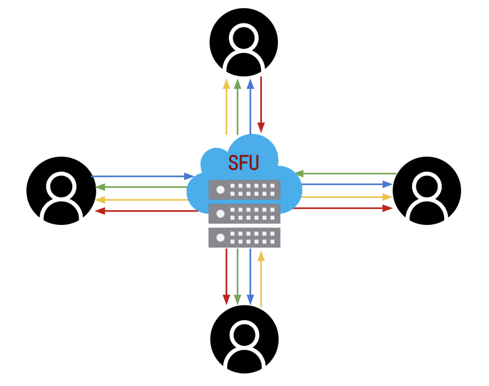

# Zomie - media server
:heavy_exclamation_mark: the project continues on branch 1peer :heavy_exclamation_mark:

Media server for <a href="https://github.com/Mamena2020/zomie-app"> zomie app</a>. 
Server running on nodejs. Each client will have 1 active peer to handle broadcasting as well as a consumer, 
this server using SFU for routing method, <a href="https://webrtc.org">WebRTC</a> for media real-time communication, and <a href="https://socket.io">Socket.io</a> for signaling & messaging.

This server also using <a href="https://github.com/Mamena2020/zomie-turn-server"> TURN Server </a> as relays media,
<a href="https://github.com/Mamena2020/zomie-turn-server"> TURN Server </a> work as a backup if STUN Server won't work because client device behind of symmetric NAT


#WebRTC Architecture - SFU (Selective Forwarding Unit)

<a href="https://medium.com/securemeeting/webrtc-architecture-basics-p2p-sfu-mcu-and-hybrid-approaches-6e7d77a46a66">

</a>


#how to use
  - config
    - create your .env from .env.example, & fill the credential
    ```
      # MEDIA SERVER CONFIG
      HOST="localhost"
      PORT=5000

      ROOM_MONITOR_INTERVAL = 60000 # 1 minute  
      # 1000 * 60

      ALLOW_TURN_SERVER = "true"  # "true" or "false"
      TURN_SERVER_HOST = "turn:ip:port" #example: "turn:192.168.1.9:3478"
      TURN_SERVER_USERNAME = "zomie"
      TURN_SERVER_PASSWORD = "password"
    ```
  - install
    - npm install
  - dev
    - npm run dev
    - nodemon server
  - prod
    - npm run start
    - node server   


# Note

- WebRTC
  - STUNT/TURN server
     - STUNT:  "urls": "stun:stun.stunprotocol.org"
        - Stunt will not working if client is under symmetric NAT. 
     - TURN: <a href="https://github.com/Mamena2020/zomie-turn-server">Zomie TURN Server </a>

- socket io
  -  version match info[1]
     - server(node js): "socket.io": "^2.4.1"
     - client(flutter):  socket_io_client: ^1.0.1 | ^1.0.2
  
  -  version match info[2]
     - server(node js): "socket.io": "^4.5.3"
     - client(flutter):  socket_io_client: ^2.0.0

  - Code for working on flutter.
      ```
          import 'package:socket_io_client/socket_io_client.dart' as IO;
          IO.Socket socket = IO.io(host,IO.OptionBuilder()
            .setTransports(['websocket']) // for Flutter or Dart VM
            .setExtraHeaders({'foo': 'bar'}) // optional
            .build());
      ```    

# References

- WebRTC
  - Articles
    - https://www.w3.org/2011/04/webrtc/wiki/images/6/63/WebRTC_RTCSender-Receiver.pdf
    - https://medium.com/securemeeting/webrtc-architecture-basics-p2p-sfu-mcu-and-hybrid-approaches-6e7d77a46a66
    - https://bloggeek.me/webrtc-rtcpeerconnection-one-per-stream/
    - consumer listen to producer media have to before set offer local sdp 
    - https://www.rtcmulticonnection.org/docs/removeStream/
    - https://webrtc.org/getting-started/unified-plan-transition-guide
  - Videos 
    - Topologies
       - https://www.youtube.com/watch?v=N1yj6gI2CTE&ab_channel=EngineeringSemester
       - https://www.youtube.com/watch?v=d2N0d6CKrbk&ab_channel=TsahiLevent-Levi
  - issues
    - https://stackoverflow.com/questions/53251527/webrtc-video-is-not-displaying
    - STUNT/TURN
       - https://stackoverflow.com/questions/64446586/webrtc-iceconnectionstatechange-disconnected

- Cors  
  - issues
    - https://stackoverflow.com/questions/43150051/how-to-enable-cors-nodejs-with-express      
- js code tips
  - file management
    - https://stackoverflow.com/questions/57108371/exporting-multiple-functions-with-arguments 
  - routing  controller
    - https://developer.mozilla.org/en-US/docs/Learn/Server-side/Express_Nodejs/routes 


- color console.log()
  ```
    Reset = "\x1b[0m"
    Bright = "\x1b[1m"
    Dim = "\x1b[2m"
    Underscore = "\x1b[4m"
    Blink = "\x1b[5m"
    Reverse = "\x1b[7m"
    Hidden = "\x1b[8m"

    FgBlack = "\x1b[30m"
    FgRed = "\x1b[31m"
    FgGreen = "\x1b[32m"
    FgYellow = "\x1b[33m"
    FgBlue = "\x1b[34m"
    FgMagenta = "\x1b[35m"
    FgCyan = "\x1b[36m"
    FgWhite = "\x1b[37m"

    BgBlack = "\x1b[40m"
    BgRed = "\x1b[41m"
    BgGreen = "\x1b[42m"
    BgYellow = "\x1b[43m"
    BgBlue = "\x1b[44m"
    BgMagenta = "\x1b[45m"
    BgCyan = "\x1b[46m"
    BgWhite = "\x1b[47m" 

  ```
    

  
